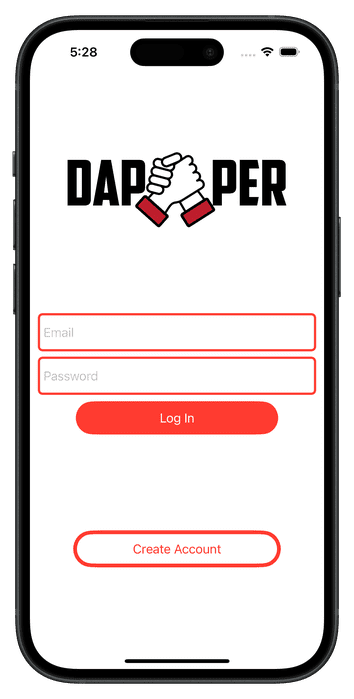
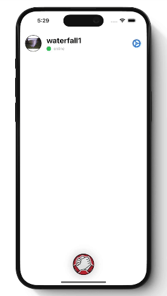

# DAPPER

	

Welcome to dapper!
Inspired by HBO's hit comedy TV-show "Silicon Valley", dapper is an app that does just one thing: sends daps to your friends!

	

## Features

Dapper is a SwiftUI app built on Firebase, which stores users' emails, profile image, and uid. 

An animation is played before sending a "dap" to a friend that mimics what a dap feels like, with friends clapping their hands together in a sign of strength! The recipient receives an image of the dap, indicating that their friend has "dapped" them. 
